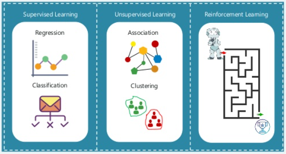
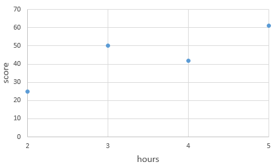
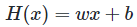
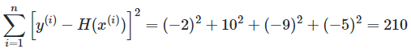
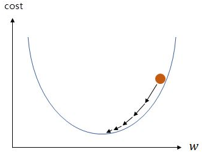
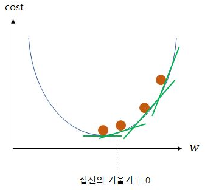

# 선형 회귀

 - 머신러닝 학습 방법
 - 선형 회귀
 - 가설 세우기
 - 비용 함수: 평균 제곱 오차(MSE)
 - 옵티마이저: 경사하강법(Gradient Descent)

 

## 1. 머신러닝 학습 방법

   

 

### 1-1. 지도학습

정답이 있는 데이터를 활용해 데이터를 학습시키는 방법  
 - 분류(Classification): 주어진 데이터를 정해진 카테고리(라벨)에 따라 분류하는 문제
    - 예측하고 싶은 종속변수가 이름 혹은 문자일 때
    - 이진 분류 문제: 스팸 메일 여부(O/X, 맞다/아니다)
    - 다중 분류 문제: 꽃의 품종 맞추기
 - 회귀(Regression): 데이터들의 특징(Feature)을 기준으로 연속된 값(그래프)를 예측하는 문제
    - 예측하고 싶은 종속변수가 숫자일 때
    - 집값 예측, 붕어빵 판매량 예측

 

### 1-2. 비지도 학습

정답이 없는 데이터를 군집화하여 새로운 데이터에 대한 결과를 예측하는 방법
 - 레이블이 없는 데이터를 가지고, 데이터를 잘 표현하는 특징들을 추출

 

### 1-3. 강화 학습

주어진 환경에서 어떤 행동을 취하고 이로부터 어떤 보상을 얻으면서 학습을 진행
 - 지도학습은 정답을 알려주는 문제집이 있는 것이라면, 강화학습은 스스로 느끼면서 실력 향상을 위해서 노력하는 수련
 - 알파고, 자율주행: 로봇에게 시행착오를 통한 학습 기회를 제공

 

## 2. 선형 회귀

시험 공부를 많이할 수록 성적이 잘 나온다. 하루에 걷는 시간이 많아질 수록 몸무게가 줄어든다. 집의 평수가 클수록 매매 가격이 비싸다.  
이는 __수학적으로 생각해보면 어떤 요인의 수치에 따라서 특정 요인의 수치가 영향을 받고있다고 볼 수 있다.__ 조금 더 수학적인 표현을 쓰면 어떤 변수의 값에 따라서 특정 변수의 값이 영향을 받고 있다 볼 수 있다.  
 - 다른 변수의 값을 변하게 하는 변수를 x, 변수 x에 의해서 값이 종속적으로 변하는 변수를 y라고 가정한다.
 - 선형 회귀는 한 개 이상의 독립 변수 x와 y의 선형 관계를 모델한다.

 

### 2-1. 단순 선형 회귀

독립 변수 x가 1개라면 단순 선형 회귀라고 한다.  
독립 변수 x와 곱해지는 값 w를 가중치(weight), 별도로 더해지는 값 b를 편향(bias)이라고 한다.  
직선의 방정식에서는 각각 직선의 기울기와 절편을 의미한다.  
 - 만약, w와 b가 없다면 하나의 식밖에 표현하지 못한다. 즉, 그래프 상으로는 하나의 직선밖에 표현하지 못한다.
 - w와 b의 값에 따라서 x와 y가 표현하는 직선은 무궁무진해진다.

   

 

### 2-2. 다중 선형 회귀

독립 변수 x가 2개 이상이라면 다중 선형 회귀라고 한다.  
집의 매매 가격은 단순히 집의 평수가 크다고 결정되는게 아니라, 집의 층의 수, 방의 갯수, 지하철 역과의 거리, 지역 등 다수의 요소와 연관이 있다.  
 - y는 여전히 1개이지만 x는 여러 개이다.

   

 

## 3. 가설 세우기

단순 선형 회귀 문제를 푼다고 가정한다.  
어떤 학생의 공부 시간에 따라서 다음과 같은 점수를 얻었다는 데이터가 있다.  
 - 2시간: 25점
 - 3시간: 50점
 - 4시간: 42점
 - 5시간: 61점

    
   데이터를 좌표 평면으로 표시

 

알고 있는 데이터로부터 x와 y의 관계를 유추하고, 이 학생이 6시간, 7시간, 8시간 공부하였을 때 성적을 예측한다.  
머신러닝에서 x와 y의 관계를 유추하기 위해 수학적으로 식을 세우는 것을 가설이라고 한다.  
 - H(x)에서 H는 Hypothesis를 의미한다.

    
   

 

위의 가설에서 w는 직선의 기울기, b는 절편으로 직선을 표현한다.  
__결국 선형 회귀는 주어진 데이터로부터 y와 x의 관계를 가장 잘 나타내는 직선을 그리는 일을 말한다. 즉, 어떤 직선인지 결정하는 것은 w와 b의 값이므로 선형 회귀에서 해야할 일은 결국 적절한 w와 b를 찾아내는 일이 된다.__  
w와 b를 찾는다면, x가 6일때, 7일때, 8일때에 대해서 쉽게 예상할 수 있다.  

 

## 4. 비용 함수: 평균 제곱 오차(MSE)

가설은 주어진 데이터에서 x와 y의 관계를 w와 b를 이용하여 식을 세우는 일이다.  
이제 해야할 일은 문제에 대한 규칙을 가장 잘 표현하는 w와 b를 찾는 일이다.  
머신러닝은 w와 b를 찾기 위해서 실제값과 가설로부터 얻은 예측값의 오차를 계산하는 식을 세우고, 이 식의 값을 최소화하는 최적의 w와 b를 찾아낸다.  
 - 목적 함수: 함수의 값을 최소화하거나, 최대화하거나 하는 목적을 가진 함수
 - 비용 함수, 손실 함수: 값을 최소화하는 목적을 가진 함수
 - 단순히 실제값과 예측값에 대한 오차를 표현하는 것이 아니라, 예측값의 오차를 줄이는 일에 최적화 된 식이어야 한다.
   - 회귀 문제의 경우 주로 평균 제곱 오차(MSE)가 사용된다.

 

### 4-1. 평균 제곱 오차 예시

   

 

위의 그래프에 임의의 w의 값 13과 임의의 b의 값 1을 가진 직선을 그린다.  
임의로 그린 직선으로 정답이 아니다. 이제 이 직선으로부터 서서히 w와 b의 값을 바꾸면서 정답인 직선을 찾아내야 한다.  

 

__x와 y의 관계를 가장 잘 나타내는 직선을 그린다는 것은 위의 그림에서 모든 점들과 위치적으로 가장 가까운 직선을 그린다는 것과 같다.__  
오차는 주어진 데이터에서 각 x에서의 실제값 y와 위의 직선에서 예측하고 있는 H(x) 값의 차이를 말한다.  
 - 오차의 크기를 측정하기 위한 가장 기본적인 방법은 각 오차를 모두 더하는 방법이 있다.

    
   y = 13x + 1 직선이 예측한 예측값을 각각 실제값으로부터 오차를 계산한 표

 

수식적으로 단순히 오차는 '실제값 - 예측값' 이라고 정의한 후에 모든 오차를 더하면 음수와 양수의 오차가 있어 오차의 절대적인 크기를 구할 수가 없다.  
떄문에, 모든 오차를 제곱하여 더하는 방법을 사용한다.  

    
   모든 오차에 대해서 제곱하여 더함 
    
   데이터의 갯수 n으로 나눔(오차의 제곱합에 대한 평균)

 

y = 13x + 1의 예측값과 실제값의 평균 제곱 오차의 값은 52.5이다.  
평균 제곱 오차의 값을 최소값으로 만드는 w와 b를 찾아내는 것이 정답인 직선을 찾아내는 일이다.  
평균 제곱 오차를 w와 b에 의한 비용 함수로 재정의하면 다음과 같다.  

   

 

__모든 점들과의 오차가 클 수록 평균 제곱 오차는 커지며, 오차가 작아질 수록 평균 제곱 오차는 작아진다.__  
__즉, 평균 최소 오차 Cost(w,b)를 최소가 되게 만드는 w와 b를 구하면 결과적으로 x와 y의 관계를 가장 잘 나타내는 직선을 그릴 수 있다.__  

 

## 5. 옵티마이저: 경사하강법(Gradient Descent)

선형 회귀를 포함한 수많은 머신러닝, 딥러닝 학습은 결국 비용 함수를 최소화하는 매개 변수인 w와 b를 찾기 위한 작업을 수행한다.  
이때 사용되는 알고리즘을 __옵티마이저__ 또는 __최적화 알고리즘__ 이라고 부른다.  

 

경사 하강법을 이해하기 위해서는 비용(Cost)과 기울기(w) 와의 관계를 이해해야 한다.  
w는 머신러닝 용어로 가중치라고 불리지만, 직선의 방정식 관점에서 보면 직선의 기술기를 의미한다.  

    
   주황색선: w가 20일 때 
   초록색선: w가 1일 때

 

y = 13x + 1 직선보다 확연히 큰 오차값들이다.  
즉, 기울기(w)가 지나치게 크면 실제값과 예측값의 오차가 커지고, 기울기가 지나치게 작아도 실제값과 예측값의 오차가 커진다. (b도 마찬가지다.)  

 

### 5-1. 가설 세우기

편의를 위해 편향 b가 없이 단순히 가중치 w만을 사용한 y = wx라는 가설 H(x)로 경사 하강법을 수행한다고 갖어한다.  

 

    
   w와 cost와의 관계

 

기울기 w가 무한대로 커지면 커질수록 cost의 값 또한 무한대로 커지고, 기울기 w가 무한대로 작아질수록 cost 값 또한 무한대로 커진다.  
__비용(Cost)이 가장 작을 때는 볼록한 부분의 맨 아래 부분으로, 기계가 해야할 일은 비용(Cost)가 가장 최소값을 가지게 하는 기울기(w)를 찾는 일이다.__  

 

    
   Cost가 가장 최소인 W를 찾아야 한다.

 

기계는 임의의 랜덤값 기울기(w)를 정한 뒤에, 맨 아래의 볼록한 부분을 향해 점차 w의 값을 수정해나간다. 이를 가능하게 하는 것이 경사 하강법이다.  
 - 미분을 이용하여 한 점에서의 순간 변화율 또는 접선에서의 기울기 개념을 이용

 

    
   Cost가 가장 최소인 W를 찾아야 한다.

 

주목할 점은 맨 아래의 볼록한 부분으로 갈수록 접선의 기울기가 점차 작아진다는 점이다.  
결국 맨 아래의 볼록한 부분에서는 접선의 기울기가 0이 된다.  

 

즉, __비용(Cost)이 최소화가 되는 지점은 접선의 기울기가 0이 되는 지점__ 이며, 또한 미분값이 0이 되는 지점이다.  
경사 하강법의 아이디어는 비용 함수를 미분하여 현재 w에서의 접선의 기울기를 구하고, 접선의 기울기가 낮은 방향으로 w의 값을 변경하고 다시 미분하고 이 과정을 접선의 기울기가 0인 곳을 향해 w의 값을 변경하는 작업을 반복하는 것이다.  

 

    
   Cost가 가장 최소인 W를 찾아야 한다.

 

## 요약

 - 추세선: 일정 기간 동안 차트상에서 두개 이상의 고점, 또는 저점을 연결해 추세를 나타내는 선
 - 평균 제곱 오차
   - 오차는 '예측값 - 실제값'으로 표현될 수 있다.
   - 이러한 오차는 음수나 양수가 될 수 있기 때문에, 무작정 오차를 합하면 무의미한 오차값이 될 수 있어 부호를 없애주는 작업이 필요하다.
   - 모든 오차에 대해서 제곱한 값을 더하고, 데이터의 갯수만큼을 나누어 오차 합의 평균을 구하면 이를 평균 제곱 오차(MSE) 라고 한다.
 - 경사 하강법
   - 오차가 적은 값이 최적의 추세선이 된다. (비용 함수를 최소화하는 매개 변수인 w와 b를 갖을 때)
   - 경사 하강법은 비용 함수를 최소화하는 매개 변수인 w와 b를 찾기 위한 방법이다.
      - 비용(Cost)이 최소화가 되는 지점은 접선의 기울기가 0이 되는 지점
      - 비용 함수를 미분하여 현재 w에서의 접선의 기울기를 구하고, 접선의 기울기가 낮은 방향으로 w의 값을 변경하고 다시 미분하고 이 과정을 접선의 기울기가 0인 곳을 향해 w의 값을 변경하는 작업을 반복
 - 선형 회귀: 데이터들의 특징(Feature)을 기준으로 연속된 값(그래프)를 예측하는 문제
   - y = wx + b: w와 b의 값에 따라서 x와 y가 표현하는 직선은 무궁무진해진다.
   - 최적의 w와 b를 찾고, 종속 변수 y를 예측
      - 최적의 w와 b는 평균 제곱 오차가 최소인 것 = 순간 변화율(미분값)이 0에 가까운 지점
      - 평균 제곱 오차가 최소(미분값이 0인 지점)인 지점을 찾기 위해 경사 하강법을 이용하여 점점 기울기가 낮은 방향으로 w와 b를 변경하면서 반복

 

## 참고

 - https://wikidocs.net/21670
 - https://comicstack.io/classroom/471e035be8f4aed9b659c0be60ba621f

