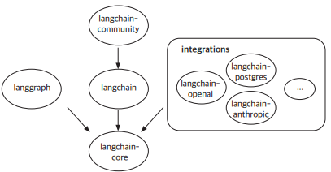

# 랭체인 살펴보기

대규모 언어 모델은 방대한 텍스트 데이터를 학습해 자연어를 이해하고 생성할 수 있는 인공지능 기술이다. 대표적인 LLM으로는 GPT, Claude, Gemini, LLaMA가 있으며, 이들은 질의응답, 문서 요약, 코드 생성 등 다양한 자연어 처리 작업에 활용되고 있다.

__LLM은 학습된 데이터에 기반해 답변을 생성하기 때문에 최신 정보 반영이나 특정 도메인 지식 제공에 한계가 있다. 이를 보완하기 위해 등장한 기술이 바로 검색 증강 생성(RAG)이다.__

검색 증강 생성은 LLM의 언어 생성 능력에 검색 기능을 결합하여, 모델이 실시간으로 외부 정보를 검색하고 이를 반영해 보다 정확하고 신뢰성 높은 답변을 생성하는 방식이다.

LLM 애플리케이션의 개발 생태계가 성장하면서, 랭체인과 함께 사용할 수 있는 특화된 도구들도 등장하였다.

 - 랭그래프: 랭체인을 중심으로 복잡한 작업을 시각화하고 API로 전환해줌
 - 랭스미스: 체인의 성능을 모니터링하고 최적화
 - 그 외 다양한 구성요소와 타사 통합 기능이 포함

<br/>

## 1. 랭체인 개요

### 1-1. 랭체인 주요 패키지

랭체인 생태계는 여러 패키지로 구성되어 있으며, 각 패키지는 특정한 역할을 수행한다.

langchain-core는 랭체인 생태계의 기본이 되는 패키지로, 다른 많은 패키지들이 이에 의존한다. langchain을 설치하면 langchain-core가 자동으로 함께 설치된다. langgraph는 langchain-core를 선택적으로 사용할 수 있다. 이는 langgraph가 langchain-core를 피어 의존성으로 취급하는 것이다.

 - `langchain-core`
    - 랭체인 중심 역할 패키지로 다양한 기본 기능들을 포함
    - 대규모 언어 모델, 데이터 벡터 저장소, 검색기와 같은 중요한 기능들을 정의하는 기본 구조가 포함되어 있음
    - langchain-core 에서는 여러 기능을 체인으로 연결할 수 있도록 랭체인 표현 언어(LCEL)를 제공한다.
 - `langchain`
    - 랭체인 패키지는 애플리케이션의 구조를 만드는 체인, 대규모 언어 모델을 사용해 작업을 처리하는 지능형 시스템인 에이전트, 정보를 검색하는 검색기 전략 등을 포함한다.
    - 특정 서비스에 국한되지 않고, 다양한 환경에서 재사용할 수 있도록 설계됨
 - `langchain-community`
    - 랭체인 커뮤니티에서 유지 관리하는 다양한 타사 서비스 통합을 포함하고 있음
    - 대규모 언어 모델, 벡터 저장소, 검색기 등의 통합 포함 (선택적 사용)
 - `파트너 패키지`
    - 랭체인은 다양한 외부 서비스와 통합할 수 있는데, 이중에서 자주 사용하는 통합은 별도의 패키지로 분리되었고, 각 패키지는 "langchain-파트너명"으로 불러올 수 있다.
    - 예시: langchain-openai, langchain-anthropic
 - `랭그래프`
    - 랭그래프는 그래프 기반 모델링을 도와주는 패키지로, 여러 작업을 동시에 처리하거나 특정 조건에 따라 작업을 분기하는 복잡한 애플리케이션을 설계할 수 있다.
    - 랭그래프는 고수준의 인터페이스를 제공하여 일반적인 에이전트를 쉽게 생성할 수 있다.
 - `랭서브`
    - 랭서브는 REST API 배포를 도와주는 패키지로, 랭체인의 체인을 REST API로 간편하게 배포할 수 있다.
 - `랭스미스`
    - 랭스미스는 대규모 언어 모델 애플리케이션을 디버깅, 테스트, 평가, 모니터링할 수 있는 개발자 플랫폼이다.
    - 개발자가 만든 애플리케이션이 안정적이고 신뢰성있게 작동하는지 확인할 수 있는 중요한 도구이다.
    - 예시: 애플리케이션의 실행 흐름을 나타내는 추적 횟수, 대규모 언어 모델 호출 횟수, 실제로 대규모 언어 모델에 요청을 보낸 횟수를 나타냄

<div align="center">
    
</div>
<br/>

### 1-2. 랭체인 버전별 기능 업데이트

 - `0.1.0`
    - langchain-core, langchain, langchain-community, 파트너 패키지로 분리
    - 패키지 구조의 분리로 생산 환경에서 사용성 개선
 - `0.1.x`
    - 이벤트 스트리밍 API를 통한 향상된 스트리밍 지원
    - 표준화된 도구 호출 지원
    - 출력을 구조화하기 위한 표준화된 인터페이스
    - @chain 데코레이터 추가
 - `0.2.0`
    - langchain에서 langchain-community에 대한 의존성 제거
    - 통합 파트너 패키지 및 생태계 확장
 - `0.3.0`
    - 내부적으로 Pydantic 1에서 Pydantic 2로 전환
    - Python 3.8 지원 종료
 - `향후 계획`
    - 랭그래프 기능 확장: 에이전트 아키텍처를 위한 주요 프레임워크로 발전시키기 위해 랭그래프에 더 많은 기능 추가
    - 벡터 스토어 업그레이드: 벡터 저장소의 추상화 기능 개선
    - 문서화 개선: 더 나은 문서화와 버전 관리된 문서 제공

<br/>

### 1-3. 랭체인의 주요 장점

 - 모듈성: 랭체인은 모든 기능을 독립적인 모듈로 제공한다. 각 모듈은 단독으로도 사용할 수 있고 다른 모듈과 조합할 수도 있어 애플리케이션 구조를 효율적으로 설계할 수 있다.
 - 통합의 용이성: 다양한 외부 시스템과 쉽게 연동할 수 있다. 외부 시스템 연동(새로운 데이터베이스나 API)을 교체할 때 설정만 변경하면 된다.
 - 확장된 기능: 랭체인 표현 언어와 실행 가능한 인터페이스를 사용하면 복잡한 워크플로우를 손쉽게 작성하고 효율적으로 실행할 수 있다.
 - 커뮤니티와 지원: 활성화된 커뮤니티에서 다양한 예제와 문제를 제공하며 지속적인 업데이트로 새로운 기능이 추가되고 있다.

<br/>

## 2. 대규모 언어 모델

랭체인은 자체적으로 대규모 언어 모델을 제공하지 않지만, 오픈AI나 코히어, 허깅페이스와 같은 여러 대규모 언어 모델 제공자들도가 쉽게 상호작용할 수 있는 표준화된 인터페이스를 제공한다.

<br/>

### 2-1. 대규모 언어 모델을 활용하는 방법

대규모 언어 모델을 활용하는 방법으로는 "모델 제공자의 API를 직접 사용하는 방법"과 "랭체인을 통해 사용하는 방법"이 있다.

랭체인을 활용하면 프롬프트 템플릿, 메모리 관리, 도구 호출 등 다양한 기능을 이용하여 복잡한 애플리케이션을 효율적으로 구축할 수 있으며, 모델 간 전환이 용이하여 코드 수정 없이 다양한 모델을 활용할 수 있다.

<br/>

 - `오픈 AI API 키 설정`
```python
# 1. .env 파일
# OPENAI_API_KEY={KEY 값}

# 2. 라이브러리 설치
!pip install python-dotenv langchain_openai

# 3. 라이브러리 불러오기
from dotenv import load_dotenv
import os
frfom langchain_openai import OpenAI

# 4. .env 파일에서 환경 변수 로드 및 LLM 초기화
load_dotenv("/content/.env")
api_key = os.getenv("OPENAI_API_KEY")
llm = OpenAI(api_key=api_key)
```
<br/>

#### 오픈AI API 예제

 - `기본 요청`
```python
import openai
from typing import List

# 기본 오픈AI 클라이언트 사용
client = openai.OpenAI()

# API 요청
response = client.chat.completions.create(
    model="gpt-4o-mini",
    messages=[{"role": "user", "content": "안녕하세요!"}]
)
response.choices[0].message.content 
```

 - `주제 요청`
```python
# 요청에 사용할 프롬프트 템플릿 정의
prompt_template = "주제 {topic}에 대해 짧은 설명을 해주세요."

# 메시지를 보내고 모델의 응답을 받는 함수
def call_chat_model(messages: List[dict]):
    response = client.chat.completions.create(
        model="gpt-4o-mini"
        messages=messages,
    )
    return response.choices[0].message.content

# 주어진 주제에 따라 설명을 요청하는 함수
def invoke_chain(topic: str):
    prompt_value = prompt_template.format(topic=topic)
    messages = [{"role": "user", "content": prompt_value}]
    return call_chat_model(messages)

# "LLM" 주제로 설명 요청
invoke_chain("LLM")
```
<br/>

#### 랭체인 예제

 - ChatPromptTemplate.from_template(): 프롬프트 템플릿 정의
```python
from langchain_openai import ChatOpenAI
from langchain_core.prompts import ChatPromptTemplate
from langchain_core.output_parsers import StrOutputParser
from langchain_core.runnables import RunnablePassthrough
from dotenv import load_dotenv

# 주어진 주제에 대해 짧은 설명을 요청하는 프롬프트 템플릿 정의
prompt = ChatPromptTemplate.from_template(
    "주제 {topic}에 대해 짧은 설명을 해주세요."
)

# 출력 파서를 문자열로 설정
output_parser = StrOutputParser()

# 오픈AI의 gpt-4o 모델을 사용한 채팅 모델 설정
model = ChatOpenAI(model="gpt-4o")

# 파이프라인 설정: 주제를 받아 프롬프트 생성, 모델로 응답을 생성, 문자열 파싱
chain = (
    {"topic": RunnablePassthrough()} # 입력받은 주제를 그대로 통과
    | prompt                         # 프롬프트 템플릿 적용
    | model                          # 모델을 사용해 응답 생성
    | output_parser                  # 응답을 문자열로 파싱
)

chain.invoke("LLM")
```
<br/>

#### 오픈AI API와 랭체인 비교

 - `오픈AI API`
    - 단순한 호출 방식
    - 유연성 낮음: 특정 모델 종속
    - 코드 복잡도 간단함: 코드 길이 짧음
    - 재사용성 낮음: 코드 일부를 수정해야 재사용 가능
    - 사용 사례: 가단한 작업
    - 모델 전환 용이성 제한적: 코드 수정 필요
 - `랭체인`
    - 모듈화된 체인 구조
    - 유연성 높음: 다양한 모델 전환 및 기능 확장 가능
    - 코드 복잡도: 체계적이지만 다소 길어질 수 있음
    - 재사용성 높음: 모듈화된 구성으로 손쉽게 재사용 가능
    - 사용 사례: 복잡하고 확장 가능한 작업
    - 모델 전환 용이성 용이: 모델 클래스를 바꾸는 것만으로 전환 가능
<br/>

### 2-2. 대규모 언어 모델 파라미터 설정

LLM에는 조정할 수 있는 기본 하이퍼파라미터(속성값)가 있다. 하이퍼파라미터는 모델이 생성하는 텍스트의 스타일, 길이, 정확도 등에 영향을 주며, 이를 통해 출력을 조정하고 최적화할 수 있다.

 - __온도__
    - 생성하는 텍스트의 다양성 조정
    - 온도 설정 값은 0 ~ 1 사이의 값
    - 값이 작을수록 예측 가능하고 일관된 출력 생성. 값이 클수록 다양하고 창의적인 출력 생성.
 - __최대 토큰 수__
    - 생성할 최대 토큰 수를 지정
    - 생성할 텍스트의 길이 제한
 - __최상위 P__
    - 생성 과정에서 특정 확률 분포 내에서 상위 P%의 토큰만을 고려하는 방식
    - 출력의 다양성 조정
 - __빈도 패널티__
    - 0 ~ 1 사이의 값
    - 값이 클수록 이미 등장한 단어나 구절이 다시 등장할 확률이 감소
    - 반복을 줄이고 텍스트의 다양성 증가
 - __존재 패널티__
    - 텍스트 내에서 단어의 존재 유무에 따라 해당 단어의 선택 확률 조정
    - 0 ~ 1 사이의 값
    - 값이 클수록 아직 텍스트에 등장하지 않은 새로운 단어 사용이 장려됨
 - __정지 시퀀스__
    - 특정 단어나 구절이 등장할 경우 생성을 멈추도록 설정
    - 출력을 특정 포인트에서 종료하고자 할 때 사용
```python
from langchain_openai import OpenAi
llm = OpenAI(
    temperature=0.7, # 온도 설정
    max_token=100,   # 최대 토큰 수 설정
    model_name="text_davinci-002" # 사용할 모델 지정
)
```
<br/>

## 3. 랭체인 표현 언어

랭체인 표현 언어는 랭체인의 여러 구성요소를 체인 형태로 연결할 수 있게 하는 선언적 방식의 언어이다.

__랭체인의 구성요소는 러너블이라는 개념으로 추상화되며, 러너블은 체인의 각 단계에서 실행 가능한 작업을 수행하는 핵심 요소이다.__

 - 러너블은 랭체인에서 작업을 실행할 수 있는 단위로, 이들을 서로 연결하여 연속적인 작업을 처리할 수 있다.
 - 러너블과 체인 연결을 통해 하나의 흐름으로 처리한다. 작업의 연결은 파이프 연산자(|)나 .pipe() 메서드를 사용하여 쉽게 구현할 수 있다.

<br/>

### 3-1. 러너블 표준 인터페이스

러너블은 여러 공통 메서드를 제공하는 표준 인터페이스를 사용한다.
 - invoke(): 단일 입력을 처리하여 결과를 반환하는 동기 메서드
 - batch(): 여러 입력을 동시에 처리하는 동기 메서드
 - stream(): 결과를 스트리밍 방식으로 반환하는 동기 메서드
 - ainvoke(): invoke()의 비동기 버전
 - abatch(): batch()의 비동기 버전
 - astream(): stream()의 비동기 버전
 - astream_log(): 중간 단계와 최종 결과를 비동기적으로 스트리밍
 - astream_events(): 체인에서 발생하는 이벤트를 비동기적으로 스트리밍

```python
from langchain_openai import ChatOpenAI
from langchain_core.prompts import ChatPromptTemplate
from langchain_core.output_parsers import StrOutputParser

# LLM 설정
model = ChatOpenAI(model="gpt-4o-mini")

# 프롬프트 템플릿 정의
prompt = ChatPromptTemplate.from_template("주제 {topic}에 대해 짧은 설명을 해주세요.")

# 출력 파서 정의
parser = StrOutputParser()

# 체인 연결
chain = prompt | model | parser

# 응답 호출
chain.invoke({"topic": "LLM"})
chain.batch([{"topic": "LLM"}, {"topic": "인플레이션"}]) # 주제 리스트에 대한 응답을 배치로 출력

# 응답을 토큰 단위로 스트리밍하여 출력
for token in chain.stream({"topic": "LLM"}):
    print(token, end="", flush=True)
```
<br/>

### 3-2. 러너블을 체인으로 연결하는 방법

#### 파이프 연산자

랭체인에서는 프롬프트와 모델이 모두 러너블로 작동하며, 프롬프트 호출의 출력 타입은 채팅 모델의 입력 타입과 동일하다. 이러한 특성 덕분에 두 요소를 체인으로 연결할 수 있다.

```python
from langchain_core.prompts import ChatPromptTemplate
from langchain_core.output_parsers import StrOutputParser

# 프롬프트 템플릿 정의
analysis_prompt = ChatPromptTemplate.from_template("이 대답을 영어로 번역해 주세요: {answer}")

compopsed_chain = {"answer": chain} | analysis_prompt | model | StrOutputParser()
composed_chain.invoke({"topic": "LLM"})
```


## 4. 프롬프트

## 5. 출력 파서

## 6. 메모리 관리: 대화 기록 유지

