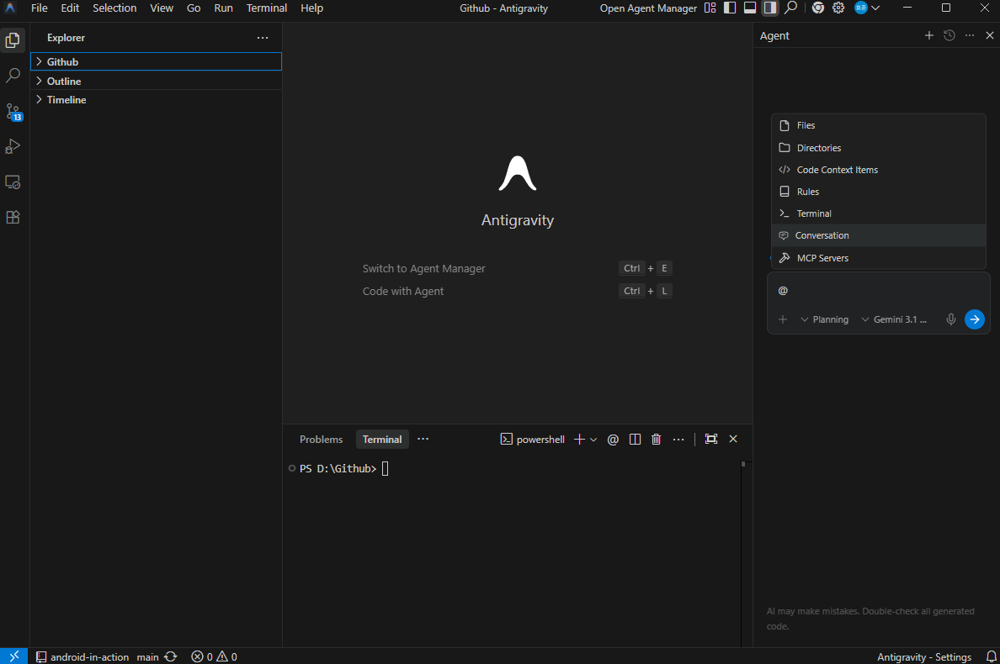
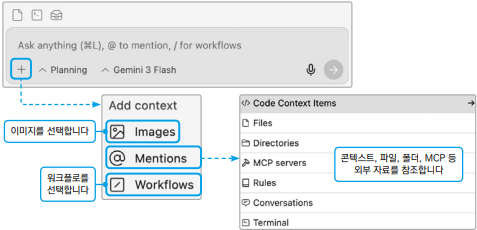

# 안티그래비티 이해하기

## 1. 안티그래비티

 - https://antigravity.google/download

 

### 1-1. 에이전트 우선 아키텍처

 - __전통 IDE 관점: 에이전트가 보조하는 형태__
    - VS Code, IntelliJ 등 전통적 IDE는 개발자가 중심이다.
    - 개발자가 파일을 열고, 코드를 작성하고, 터미널에 명령어를 실행하고, 직접 결과를 확인한다.
    - 기존 도구들이 표면안에 AI를 내장한 구조
 - __에이전트 IDE 관점: 에이전트 중심의 형태__
    - 에이전트가 중심이고 그 밖의 것들은 에이전트가 사용하는 도구가 된다.
    - 기존의 AI 코딩 보조 도구(GitHub Copilot 등)가 단순히 코드를 한 줄씩 완성해주는 방식이었다면, Antigravity는 AI가 스스로 계획을 세우고, 코드를 짜고, 실행까지 하는 '에이전트' 역할을 수행한다.
    - 사용자는 에이전트 매니저(Agent Manager)를 통해 여러 개의 AI 에이전트에게 서로 다른 작업(버그 수정, 기능 구현, 리서치 등)을 동시에 시킬 수 있다.

 

### 1-2. 에디터 뷰

 - __콘텍스트 버튼__
    - 에이전트가 작업할 때 도움이 될 만한 이미지나 파일을 첨부하거나 워크플로 선택
 - __대화 모드__
    - Planning: 에이전트에게 모든 걸 맡기지 않고 사람이 검수하는 방식
    - Fast: 풀 에이전틱 모드로 에이전트가 스스로 판단하며 모든 작업을 빠르게 완료

     
    

 

### 1-3. 매니저 뷰: 에이전트 오케스트레이션하기

매니저 뷰에서는 여러 에이전트를 동시에 생성하고 관리할 수 있다. 여러 에이전트를 사용하는 것을 오케스트레이션이라고 부른다.  

여러 개의 에이전트가 동시에 작업을 수행하면 개발자는 진행 상황을 모니터링한다. 순차적으로 작업을 기다릴 필요가 없다. 단, 하나의 워크트리에서 여러 작업을 동시에 진행하면 하나의 파일을 여러 에이전트가 동시에 건드리는 충돌이 발생할 수 있다.

 - __오케스트레이션__
   - 에이전트 A: 백엔드 API 개발
   - 에이전트 B: 프론트엔드 UI 구현
   - 에이전트 C: 테스트 코드 작성
   - 에이전트 D: 문서화
 - __워크스페이스 관리__
   - 기능별 분리: feature//auth, feeature/payment 등 기능 브랜치별로 워크스페이스를 생성
   - 환경별 분리: development, staging, production 환경별로 워크스페이스를 구성
   - 팀원별 분리: 팀 프로젝트에서 각 팀원이 담당하는 모듈별로 워크스페이스를 관리
   - 프로젝트별 분리: 서로 완전히 독립적인 프로젝트를 워크스페이스로 지정하고 동시에 개발
   - 워크트리별 분리: 하나의 프로젝트에 여러 워크트리를 생성하고 동시에 개발

 

## 2. 아티팩트: 안티그래비티에게 작업 브리핑받기

아티팩트는 에이전트가 구현 계획, 코드 수정 전후 비교, 실행한 테스트 결과, 브라우저에게 로그인하는 영상을 요약해서 제공하는 기능이다.

 - __작업 목록__
   - 에이전트가 복잡한 작업을 진행하기 위한 작업을 정리한 마크다운 파일
 - __구현 계획__
   - 각 작업을 진행하기 위한 상세한 계획
   - 안티그래비티는 자동으로 계획을 구현하지만 동시에 중요한 결정은 꼭 사용자에게 물어본다.
 - __워크스루__
   - 수정하는 과정을 보여주는 아티팩트
   - 워크스루에서 작업 진행 중 어떤 기능이 새로 생겼는지, 어떤 파일이 수정됐는지, 그로 인해 어떤 결과를 얻을 수 있었는지 확인할 수 있다.
 - __스크린샷과 브라우저 녹화__
   - 에이전트가 직접 브라우저에서 작업을 수행하고 결과물을 스크린샷이나 동영상으로 녹화해 사용자에게 보여준다.
 - __지식__
   - 에이전트의 기억력을 효율적으로 확장하기 위한 아티팩트 타입
   - 안티그래비티가 중요한 인사이트, 패턴, 특징 등을 추출해서 따로 지식에 저장해둔다.
   - 작업을 할 때 자동으로 필요한 지식을 추출해서 콘텍스트 윈도우에 주입한다.

 

## 3. 룰 & 워크플로: 작업 일관성 높이기

 - __룰__
   - 룰은 에이전트가 지키도록 정의한 제약이다.
   - 워크스페이스 단위 또는 시스템 단위로 정의할 수 있다.
   - `룰 모드`
      - Manual: 에이전트 채팅 창에 직접 태그해서 사용
      - Always On: 항상 에이전트의 콘텍스트 윈도우에 포함된다.
      - Model Decision: 룰의 정의에 따라 필요할 것 같을 때 에이전트가 직접 사용 결정
      - Glob: 파일명 패턴에 따라 해당되는 파일을 작업할 때 사용

