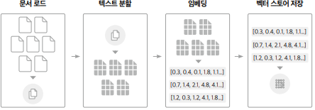
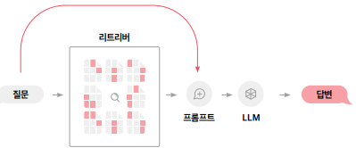
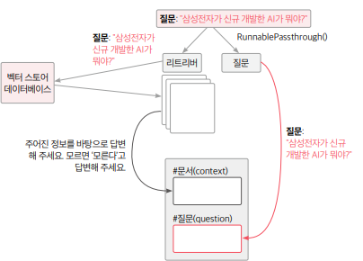

# RAG 이해하기

## 1. RAG를 사용해야 하는 이유

RAG는 ChatGPT의 한계를 보완하기 위해 주목받기 시작한 기술이다. __RAG란 Retrieval-Argumented Generation의 줄임말로, 검색(Retrieval), 증강(Argumented), 생성(Generation)이라는 의미를 담고 있으며, 거대 언어 모델(LLM)이 외부의 신뢰할 수 있는 지식 데이터베이스를 참조하여 최적화된 응답을 생성하는 기술이다.__

 - 최신 정보를 기반으로 답변할 수 있으며, LLM이 정보를 찾을 수 없는 경우 '검색' 기능을 활용해 답변을 제공할 수 있다.
 - 회사 내부에 데이터베이스를 구현함으로써 개인이나 회사의 내부 데이터를 참고하여 GPT가 답변할 수 있다.
 - 문서를 내부 데이터베이스에 저장하고 지속적으로 데이터 축적할 수 있으며, 저장된 데이터베이스에서 원하는 정보를 검색한 후 이를 바탕으로 답변을 생성할 수 있다.
 - 저장된 데이터베이스에서 답변의 출처를 역으로 검색하고 검증하는 방식으로 할루시네이션 현상을 줄일 수 있다.

<br/>

## 2. RAG의 기막힌 능력

 - `최신성과 확장성 확보`
    - 최신 데이터 반영: LLM 자체는 학습 시점 이후의 정보를 모를 수 있지만, RAG는 외부 데이터베이스·문서·API에서 실시간으로 검색해 답변을 강화할 수 있음.
    - 도메인 확장 용이: 특정 산업(법률, 의료, 세무 등) 지식이나 기업 내부 문서를 추가 학습 없이 연결해 활용 가능.
 - `정확도 향상`
    - 할루시네이션 감소: 모델이 근거 없는 답을 생성하는 것을 줄이고, 실제 문서를 근거로 답변 가능.
    - 근거 제시 가능: 검색한 원문을 함께 보여주면 신뢰성과 검증 가능성이 높아짐.
 - `비용 및 효율성`
    - 재학습 불필요: 모델 자체를 다시 학습하거나 fine-tuning 하지 않아도 새로운 지식을 반영할 수 있음.
    - 경량 업데이트 가능: 단순히 검색 인덱스나 벡터 스토어를 갱신하는 것만으로 최신 지식 반영.
 - `유연한 아키텍처`
    - 멀티소스 활용 가능: DB, 위키, API, 내부 문서, 이메일 등 다양한 지식원을 연결 가능.
    - 검색 전략 다양화: keyword search, semantic search, hybrid search 등을 조합해 성능 최적화.
 - `개인화 및 커스터마이징`
    - 사용자 맞춤 응답: 개인 노트, 사내 데이터베이스 등 사용자 고유 데이터 기반의 개인화된 답변 제공 가능.
    - 컨텍스트 강화: 질문자의 맥락(이전 대화 기록, 도메인 지식 등)에 맞춰 더 관련성 높은 응답 생성.

<br/>

## 3. LangChain을 이용한 RAG 시스템 구축

LangChain을 사용하면 어떤 데이터베이스를 쓸지, 어떤 임베더(텍스트 같은 정보를 연산 가능한 수치로 변환해 주는 도구)를 쓸지, 어떤 종류의 문서를 업로드할지 등만 결정해서 가져다 쓰면 된다.

<br/>

### 3-1. 사전 단계

 - `문서 로드`
    - 외부 데이터 소스에서 필요한 문서를 불러와서 초기 처리를 한다.
    - PDF, 엑셀, 논문, 이미지, 데이터베이스 등 문서를 로드한다.
 - `텍스트 분할`
    - 로드된 문서를 처리 가능한 작은 단위인 청크(chunk)로 분할한다.
 - `임베딩`
    - 분할된 청크를 벡터 형태로 변환하여 문서의 의미를 수치화한다. 자연어를 컴퓨터가 이해할 수 있는 수치로 변경하는 과정
    - 유사도를 계산하기 위해 각 청크의 값을 수학적인 표현으로 바꿔야 하는데 이것을 임베딩이라고 한다.
 - `벡터 스토어 저장`
    - 임베딩된 청크를 데이터베이스에 저장한다. 이는 요약된 키워드를 색인으로 뽑아서 나중에 빠르게 찾을 수 있게 정리해두는 과정
    - 각 청크에 임베딩된 값을 벡터 스토어에 저장해두고, 데이터베이스에 검색어로 쿼리를 요청할 때마다 가져올 수 있게 한다.

__문서를 로드해서 텍스트를 청크 단위로 분할하고 각각의 청크를 임베딩해서 유사도 계산을 위해 벡터 값을 저장하는 과정을 전처리 과정이라고 한다.__

<div align="center">
    
</div>
<br/>

### 3-2. 실행 단계

 - `리트리버`
    - 질문이 주어지면, 이와 관련된 벡터를 벡터 데이터베이스에서 검색한다.
    - 사용자가 질문을 입력하면 이를 임베딩 단계와 동일한 방식으로 벡터로 변환한다. 이렇게 변환된 질문 벡터는 미리 준비된 데이터베이스의 문서 벡터들과 비교되어 유사성이 계산된다.
        - 코사인 유사성이나 MMR 같은 알고리즘이 이 비교 과정에서 활용되며, 이를 통해 질문과 가장 관련이 깊은 단락을들 선별한다.
        - 이때 k 값을 설정하여 선택할 청크의 수를 조절할 수 있다.
 - `프롬프트`
    - 검색된 정보를 바탕으로 언어 모델을 위한 질문을 구성한다.
    - 리트리버가 검색해 온 문서들을 바탕으로 언어 모델이 사용할 질문이나 명령을 만드는 과정이다.
        - 이 단계에서 여러 정보들을 하나로 통합하고 언어 모델이 특정 컨텍스트 안에서 제대로 작동하도록 안내하하는 역할을 한다.
 - `LLM`
    - 구성된 프롬프트를 사용하여 언어 모델이 답변을 생성한다.
    - 앞서 구성된 프롬프트를 입력으로 받아 대규모 언어 모델을 통해 실제 응답을 생성한다.
 - `체인 생성`
    - 이전의 모든 과정을 하나의 파이프라인으로 묶어 주는 체인을 생성한다.
    - LCEL(LangChain Expression Language) 문법을 활용해 앞서 설명한 일곱 단계를 하나로 묶어 완전한 RAG 파이프라인으로 조립하는 단계이다.

<div align="center">
    <br/>
    
</div>
<br/>

```python
chain = (
    {"context": retriever, "question": RunnablePassthrough()}
    | prompt | llm | StrOutputParser()
)

question = "삼성전자가 신규 개발한 AI의 이름은?"
response = chain.invoke(question)
print(response)
```

