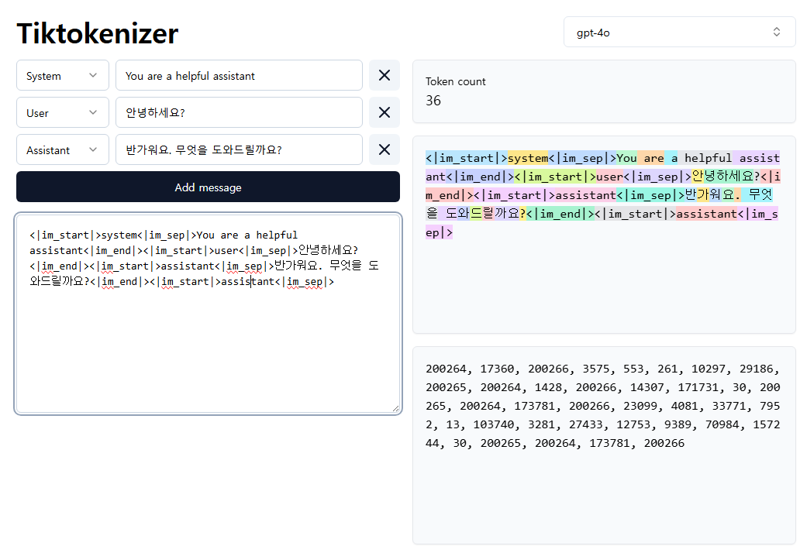

# LLM 기본 용어

## 1. 토큰, 토큰 계산기, 모델별 토큰 비용

토큰은 자연어 처리에서 텍스트를 처리하기 위해 나눈 작은 단위(단어, 서브워드, 문자 등)이다. 텍스트를 토큰으로 나누는 과정을 토큰화라고 한다. 간단히 말해, 주어진 문장을 토큰화 과정을 통해 여러 개의 토큰으로 나눈 것이다.

<br/>

### 1-1. 토큰화 방식

 - `문자 기반 토큰화`
    - 텍스트를 개별 문자로 쪼개어 각 문자를 하나의 토큰으로 취급하는 방식
```
Hello, world
["H", "e", "l", "l", "o", ",", "w", "o", "r", "l", "d"]
```
<br/>

 - `단어 기반 토큰화`
    - 텍스트를 단어 단위로 나누는 방식
    - 모든 ㄷ나어를 저장한 단어 사전을 만들어야 하는데, 한 단어에서 나올 수 있는 모든 형태를 다 가지고 있어야 하므로 비효율적이다.
```
Hello, world
["Hello", ",", "world"]
```
<br/>

 - `서브워드 기반 토큰화`
    - 단어 전체를 토큰화하는 대신 서브워드를 활용
    - 서브워드란 단어보다 작은 단위로, 접두사, 접미사, 어근 등이 해당된다.
    - 대표적인 방법인 바이트 페어 인코딩(BPE: Byte Pair Encoding)은 단어를 처음에 문자 단위로 분해한 후, 자주 등장하는 문자 쌍을 결합해 더 큰 서브워드를 만드는 방식이다.
```
unhappiness -> un과 happiness 2개의 토큰으로 분리
이를 위해 단어를 작은 단위로 쪼갠 후, 자주 등장하는 단위를 빈도에 따라 묶어 나감
처음에는 u, n, h, a 등의 문자 단위로 나눈 뒤, un, uh, ha 등으로 각 문자 쌍을 묶어 빈도 수를 계산핳고, 자주 함께 등장하는 단어 쌍을 하나의 토큰으로 결합
```
<br/>

### 1-2. 토큰 사용량 계산하기

토큰 사용량에 따라 비용을 정하는 기준이 된다. GPT 모델에서는 입력과 출력 모두 토큰 수 계산에 포함된다. 즉, 사용자가 입력한 텍스트와 시스템의 답변까지 모두 토큰으로 계산된다.

 - `Tiktokenizer`
    - https://tiktokenizer.vercel.app/
    - OpenAI 모델에서 사용하는 토큰을 계산하고 시각화하는 도구로, 입력된 텍스트를 토큰화하여 얼마나 많은 토큰이 사용되는지 확인할 수 있다.
<div align="center">
    
</div>
<br/>

## 2. 모델의 입출력과 컨텍스트 윈도우

컨텍스트 윈도우란 모델이 한 번에 처리하고 이해할 수 있는 전체 텍스트의 문맥 범위를 의미한다. 

LLM이 한 번에 처리할 수 있는 입력과 출력의 총합 토큰 수를 컨텍스트 길이라고 한다. 모델마다 컨텍스트 윈도우에 제한이 있다.

 - GPT-3.5 컨텍스트 길이: 약 16k 토큰
 - GPT-4 컨텍스트 길이: 기본 버전 8,192토큰, 확장 버전은 최대 32,768 토큰

