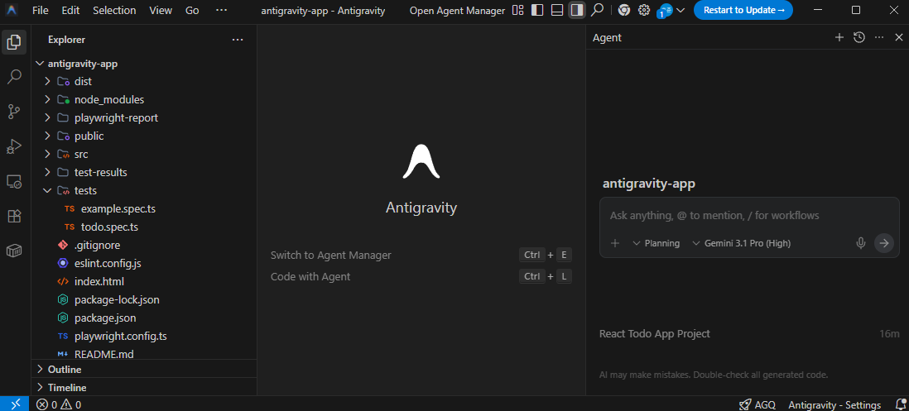

# 안티그래비티(Antigravity)

## 참고 사이트

 - 안티그래비티 공식 사이트: https://antigravity.google/
 - 신영선의 AI 탐구
    - 안티그래비티 기초: https://www.youtube.com/watch?v=PVnHT5WyHko
    - 안티그래비티 8가지 설정: https://www.youtube.com/watch?v=kan_mU--mYE
    - 안티그래비티 워크플로우: https://www.youtube.com/watch?v=RESynvEqFkE
 - 라핀
    - 안티그래비티 기초: https://www.youtube.com/watch?v=TY36db4hZbQ
    - 안티그래비티 워크플로우: https://www.youtube.com/watch?v=nHNHCnhJ5z4
 - AI튜터랩
    - 안티그래비티 4가지 팁: https://www.youtube.com/watch?v=ZkhlvyS_TQ0
    - 안티그래비티 Skills: https://www.youtube.com/watch?v=hhkUXkjp66A
 - 오준석의 생존코딩
    - 안티그래비티 에이전트 매니저: https://www.youtube.com/watch?v=t5EaHNQd3zU
 - 위키독스
    - 구글 안티그래비티: https://wikidocs.net/book/18821
 - 안티그래비티 설명
    - 안티그래비티: https://www.elancer.co.kr/blog/detail/1046
    - 비개발자를 위한 안티그래비티: https://wikidocs.net/book/18574


## 1. 안티그래비티

안티그래비티는 2025년 11월 18일에 구글에서 공개한 AI 코딩 도구로 AI 에이전트를 중심으로 설계된 통합 개발 환경을 말한다.

기존 IDE가 개발자의 입력을 보조하는 역할에 가까웠다면, __안티그래비티는 AI가 코드 작성, 터미널 실행, 브라우저 테스트까지 하나의 흐름 안에서 처리하도록 설계__ 되었다.

 - 사용자가 목표를 정의하면 AI 에이전트가 코드 작성, 터미널 명령 실행, 브라우저 테스트, 오류 수정, 결과 검증까지 단계적으로 수행한다.
 - 에이전트가 수행한 작업은 태스크 리스트, 구현 계획, 스크린샷, 브라우저 녹화 같은 형태로 시각화된다. 단순히 코드를 생성하는 것이 아니라 무엇을 어떻게 했는지 확인할 수 있는 구조를 제공해 에이전트의 작업 과정을 투명하게 파악할 수 있다.

<br/>

## 2. 안티그래비티 설치

메인 홈페이지에서 다운받아서 설치 후 사용한다.

 - 안티그래비티 공식 사이트: https://antigravity.google/
 - 설치 옵션
    - __Choose setup flow__
        - Start fresh: 기존 설정 없이 처음부터 시작
        - Import from VS Code: VS Code에서 사용하던 익스텐션, 단축키, 테마 등의 설정을 그대로 가져옴
        - Import from Cursor: Cursor 기존 설정을 그대로 가져옴
    - __Choose an editor theme type__
        - 원하는 에디터 테마 선택
        - Dark, Tokyo Night, Light, Solarized Light
    - __How do you want to use the Antigravity Agent__
        - 에이전트 운용 방법 선택
        - Strict Mode: 에이전트 실행에 엄격한 제한을 두는 방식
        - Review-driven development: 에이전트가 작업 전 사용자 검토를 요청하는 방식 (기본 권장)
        - Agent-driven development: 에이전트가 자율적으로 작업을 수행하는 방식
        - Custom configuration: 사용자가 직접 세부 설정을 구성하는 방식

<br/>

### 2-1. 기본 확장팩 설치

 - 한국어 언어팩
 - AGQ(Antigravity Quota): 모델별 잔여 쿼터 확인
 - Claude Code for VS Code: 안티그래비티 내부에서 Claude Code를 바로 사용할 수 있게 해주는 확장팩. 하나의 워크플로우 안에서 활용이 가능하다. Gemini 3 Pro로 기획과 설계를 맡기고, 복잡한 로직 구현이나 구조 정리는 Claude Code에 위임하는 방식으로 두 모델 병행 활용 가능

<br/>

## 3. 기본 사용법

### 3-1. 안티그래비티 기본 설명

 - 탐색기: 현재 작업 중인 워크스페이스(폴더) 내부의 모든 파일과 구조
 - 편집창: 선택한 파일의 내용을 고치거나 새로운 내용을 작성하는 메인 스테이지
 - 에이전트 패널: AI 에이전트와 대화하며 프로젝트 전반의 업무를 지시하고 소통하는 창구

<div align="center">
    
</div>
<br/>

#### 에이전트 주요 설정

 - __대화 단위(Conversation-Level)__
    - Planning(계획): 에이전트가 작업을 실행하기 전에 계획을 세울 수 있다.
    - Fast(고속): 에이전트가 작업을 즉시 실행한다.
 - __아티팩트 검토 정책(Artifact Review Policy)__
    - Always Proceed(항상 진행): 에이전트가 절대 검토를 요청하지 않음
    - Agent Decides(에이전트 결정): 검토 요청 시기를 에이전트가 결정함
    - Request Review(검토 요청): 에이전트가 항상 검토를 요청함
 - __터미널 명령 자동 실행 (Terminal Command Auto Execution)__
    - Always Proceed(항상 진행): 에이전트가 자동으로 터미널 명령 실행
    - Request Review(검토 요청): 에이전트가 검토 요청 후 터미널 명령 실행

<br/>

#### Manager View: 멀티 에이전트 (미션 컨트롤)

Manager View는 안티그래비티의 성격을 가장 선명하게 보여준다. 단일 채팅창이 아니라, 여러 작업이 Inbox처럼 쌓이고 각 작업마다 에이전트를 붙여 병렬로 처리할 수 있다. 예컨대 한쪽에서는 로그인 기능을 고치고, 다른 한쪽에서는 UI를 다듬고, 또 다른 쪽에서는 테스트를 작성하는 식으로 분업을 설계할 수 있다. __이때 개발자는 코드를 직접 다 치는 사람이 아니라, 여러 에이전트를 운영하는 사람에 가까워진다.__

 - 프로젝트 창을 여러개 열지 않고도, 채팅창만으로 여러 프로젝트를 관리할 수 있다.
 - 대화창 혹은 Inbox 패널을 통해서 터미널 명령 실행, 브라우저 사용, 또는 구현 계획 수립을 위해 사용자 승인을 대기 중인 대화가 있는지 확인할 수 있다.

<br/>

### 3-2. 규칙 (Rules)

규칙은 에이전트가 로컬 및 전역 수준에서 따르도록 수동으로 정의된 제약 조건이다. 규칙을 통해 사용자는 에이전트가 자신의 사용 사례와 스타일에 맞는 행동을 따르도록 안내할 수 있다.

 - 전역 규칙 (`~/.gemini/GEMINI.md`)
    - 모든 워크스페이스에 적용되는 규칙
 - 워크스페이스 규칙 (`<workspace>/.agent/rules`)
    - 해당 워크스페이스에만 적용되는 규칙
    - Manual(수동): 에이전트 입력 상자에서 @멘션을 통해 수동으로 규칙을 활성화한다.
    - Always On(항상 켜짐): 규칙이 상항 적용된다.
    - Model Decision(모델 결정): 규칙에 대한 자연어 설명을 바탕으로, 모델이 규칙 적용 여부를 결정한다.
    - Glob: 정의한 glob 패턴을 기반으로, 패턴과 일치하는 모든 팡리에 규칙이 적용된다.

<br/>

### 3-3. 스킬 (Skills)

스킬은 에이전트의 기능을 확장하기 위한 오픈 표준으로 에이전트가 특정 작업을 수행할 떄 따를 수 있는 지침이 포함된 SKILL.md 파일이 있는 폴더이다. 대화를 시작하면 에이전트는 이름과 설명이 포함된 사용 가능한 스킬 목록을 확인하고, 작업과 관련된 스킬이 보이면 에이전트는 전체 지침을 읽고 이를 따른다.

 - 특정 유형의 작업에 접근하는 방법에 대한 지침
 - 따라야 할 모범 사례 및 컨벤션
 - 에이전트가 사용할 수 있는 선택적 스크립트 및 리소스

<br/>

#### 스킬 저장 위치

 - `~/.gemini/antigravity/skills/<skill-folder>/`: 전역 스킬로 모든 프로젝트에서 작동한다. 어디서나 사용하고 싶은 개인용 유틸리티나 범용 도구에 사용한다.
 - `<workspace>/.agent/skills/<skill-folder>/`: 워크스페이스 스킬로 팀의 배포 프로세스나 테스트 컨벤션과 같은 프로젝트별 워크플로우에 적합하다.

```
.agent/skills/my-skill/
├─── SKILL.md       # 메인 지침 (필수)
├─── scripts/       # 헬퍼 스크립트 (선택 사항)
├─── examples/      # 참조 구현 (선택 사항)
└─── resources/     # 템플릿 및 기타 자산 (선택 사항)
```

<br/>

#### 스킬 만들기

스킬을 생성하려면 스킬 디렉토리에서 폴더를 만들고, `SKILL.md` 파일을 추가한다.

 - `.agent/skills/my-skill/SKILL.md`
    - 프론트매터 필드
        - name: 스킬의 고유 식별자
        - description: 스킬이 무엇을 하고 언제 사용하는지에 대한 명확한 설명. 에이전트가 스킬을 적용할지 결정할 때 보는 내용
    - 본문
        - 에이전트가 스킬을 로드한 후 따라야 할 구체적인 행동 지침 정의
        - 목표 및 배경, 단계별 지침, 업무 표준, 주의사항, 의사결정 트리, 레퍼런스 연결 등
```md
---
name: my-skill
description: 특정 작업을 돕습니다. X나 Y를 해야 할 때 사용하세요.
---

# 나의 스킬 (My Skill)

에이전트를 위한 상세 지침이 여기에 들어갑니다.

## 언제 이 스킬을 사용하는가

- ...할 때 사용하세요
- 이것은 ...에 유용합니다

## 사용 방법

에이전트가 따라야 할 단계별 안내, 컨벤션, 패턴.
```
<br/>

### 3-4. 워크플로우

워크플로우를 사용하면 서비스 배포나 PR코멘트 응답과 같은 반복적인 작업 세트를 통해 에이전트를 안내하는 일련의 단계를 정의할 수 있다. 이러한 워크플로우는 마크다운 파일로 저장되어 주요 프로세스를 쉽게 반복 실행할 수 있는 방법을 제공한다.

 - 사전 정의된 일련의 명령 세트
 - 매번 복잡한 프롬프트를 길게 적는 대신, 미리 정해진 시나리오를 슬래시(`/`) 명령어 하나로 실행하는 기능

#### 규칙(Rules)와 워크플로우(Workflows)

규칙과 워크플로우는 에이전트의 행동을 제어한다는 점은 같지만, 지침과 절차라는 핵심적인 차이가 있다.

 - 규칙(Rules)
    - 핵심 개념: 지침(How)
    - 작동 방식: 모든 대화에서 항상 기본으로 적용
    - 실행 구조: 에이전트의 사고 방식과 태도 결정
    - 주요 용도: 말투, 금지 사항, 답변 스타일 고정
 - 워크플로우(Workflows)
    - 핵심 개념: 절차(What)
    - 작동 방식: 슬래시(`/`) 명령 시에만 명시적 실행
    - 실행 구조: 정의된 작업 순서를 따라감
    - 주요 용도: 다단계 분석, 보고서 생성, 복잡한 자동화

<br/>

#### 워크플로우 저장 위치

 - `~/.gemini/antigravity/global_workflows/`: 전역 워크플로우
 - `<workspace>/.agent/workflows/`: 워크스페이스 워크플로우

<br/>

#### 워크플로우 실행

워크플로우는 규칙처럼 항상 켜져 있는 것이 아니라, 내가 필요할 떄 명령어를 통해 호출하는 방식이다.

 - __즉시 실행__: 채팅창에 `/워크플로우명`을 입력하여 즉시 실행한다.
 - __연쇄 호출__: 워크플로우 마크다운 파일 내부에 다른 워크플로우 명령어를 직접 입력해 두면, 해당 단계에서 자동으로 다음 워크플로우가 호출된다. 이를 통해 복잡한 전체 공정을 작은 단위의 워크플로우들로 쪼개어 관리할 수 있다.

<br/>

#### 워크플로우 활용 예시

 - __블로그 초안 작성__
    - 특정 규칙 파일을 먼저 읽어 페르소나와 스타일을 파악하고, 제공한 자료를 분석하여 일관된 품질의 초안을 생성
```md
# 블로그 초안 작성 워크플로우 (Draft Writing Workflow)

이 워크플로우는 `blog-writing-rule.md`에 정의된 페르소나, 톤앤매너, 포맷팅 규칙을 준수하여 블로그 초안을 작성하는 절차입니다.

## 1. 규칙 로드 및 숙지 (Load Rules)
가장 먼저 작성 규칙을 읽고 기억해야 합니다.
- **Action**: `view_file` 도구를 사용하여 아래 경로의 규칙 파일을 읽으세요.
  - 경로: `c:\Users\wogus\Desktop\Obsidian_Vault\.agent\rules\blog-writing-rule.md`

## 2. 참고 자료 분석 (Analyze References)
사용자가 제공한 이전 글과 참고 자료(링크, 파일, 텍스트 등)를 읽고 분석합니다.
- **Action**:
  - 만약 참고 자료가 제공되지 않았다면, 사용자에게 참고할 파일이나 URL을 요청하세요.
  - 제공된 자료를 `view_file` 또는 `read_url_content`로 읽으세요.
- **Analysis**:
  - 이전 글이 있다면 읽고 흐름을 파악합니다.
  - 자료의 핵심 주제와 흐름을 파악합니다.
  - `blog-writing-rule.md`의 '구조(Structure)'에 맞춰 어떻게 배치할지 구상합니다.

## 3. 초안 작성 (Drafting)
분석한 내용과 `blog-writing-rule.md` 규칙을 바탕으로 초안을 작성합니다. 문서는 **Markdown** 형식으로 작성해야 합니다.

## 4. 자가 점검 (Self-Review)
작성된 초안을 사용자에게 보여주기 전에, `blog-writing-rule.md`의 체크리스트를 기준으로 스스로 점검하세요.

## 5. 결과 제출 (Submit)
- 점검이 끝난 초안을 `new_draft.md`로 사용자가 지정한 폴더에 저장하세요.
```

 - __회의록 요약 및 할 일 관리__
```md
# 회의록 정리 워크플로우 (Meeting Minutes)

산발적인 회의 메모를 구조화된 회의록으로 변환하고, 각 담당자가 해야 할 일을 도출합니다.

## 1. 텍스트 정제 (Clean Up)
- **Input**: 사용자가 대충 적은 회의 메모 텍스트
- **Action**: 오타를 수정하고, 문어체로 다듬어 정돈된 문장으로 변환합니다.

## 2. 구조화 및 요약 (Structure & Summarize)
- **Action**: 내용을 [안건] - [주요 논의사항] - [결정사항] 구조로 재배치합니다.
- **Goal**: 회의에 참석하지 않은 사람도 3분 안에 내용을 파악할 수 있도록 핵심 위주로 요약합니다.

## 3. 액션 아이템 도출 (Extract Action Items)
- **Action**: 본문 내용 중 '누가', '언제까지', '무엇을' 해야 하는지 찾아내어 표 형태로 정리합니다.
```
<br/>

### 3-5. MCP

MCP(Model Context Protocol)는 AI 모델이 외부 데이터나 도구와 상호작용할 수 있도록 해주는 개방형 표준 프로토콜이다.

 - __외부 도구와의 연결__: AI는 연결된 MCP 서버의 데이터를 읽어 제안의 근거로 활용할 수 있다.

<br/>

#### MCP 서버 설치

MCP를 사용하려면 Antigravity와 외부 앱을 연결해주는 MCP 서버를 설치해야 한다.

 - __MCP Store에서 설치__
    - Antigravity 툴 내부의 내장 스토어를 이용할 수 있다.
 - __Config 파일 수정해서 수동으로 설치__
    - Antigravity 우측 상단 `...` 메뉴 > `MCP Servers` > `Manager MCP Servers` > `View raw config` 클릭
```json
{
    "mcpServers": {
        // ..

        // Playwright MCP 서버
        "playwright": {
            "command": "npx",
            "args": [
                "@playwright/mcp@latest"
            ]
        },

        // 구글 캘린더 MCP 서버
        "google-calendar": {
            "command": "npx",
            "args": [
            "-y",
            "@modelcontextprotocol/server-google-calendar"
            ],
            "env": {
            "GOOGLE_CLIENT_ID": "ID",
            "GOOGLE_CLIENT_SECRET": "SECRET"
            }
        }
    }
}
```

<br/>

## 4. 활용 노하우

#### 기획: 구현 전에 구조부터 잡기

프롬프트로 `xxx 만들어줘`를 바로 입력하기 보다는 먼저 원하는 기능과 구조를 정리해서 전달하는 것이 좋다.

 - 에이전트가 기능 목록과 구현 순서를 먼저 정리해준다.
```
독서, 운동, 공부 섹션으로 나뉜 성장 일지 웹페이지를 만들고 싶어.
성공한 날은 느낀점, 실패한 날은 실패 이유를 기록하고, 주간,월간,연간 대시보드로 통계를 볼 수 있어야 해.
코드 작성 전에 전체 구조와 데이터 설계를 먼저 제안해줘
```
<br/>

#### Planning 모드: 구조와 로직은 계획 후 실행

전체 시스템에 영향을 주는 작업은 `Planning 모드`에서 진행하는 것이 안전하다. 에이전트가 바로 코드를 작성하지 않고 Implementation Plan을 먼저 제안하기 떄문에, 의도와 다른 방향으로 구현되는 것을 사전에 방지할 수 있다.

계획을 확인하고 승인한 뒤 구현이 시작되기 떄문에 복잡한 작업일수록 Planning 모드를 활용하는 것이 완성도를 높이는 데 유리하다.

```
1. 전체 페이지 구조 설계 및 섹션 구분
2. 날짜, 카테고리, 성공/실패 여부, 내용을 담는 데이터 구조 설계
3. 주간/월간/연간 통계 로직 구성
4. 대시보드 차트 구성 방식 결정
```

<br/>

#### Fast 모드: 빠르게 처리할 수 있는 작업은 즉시 실행

구조가 잡힌 이후 세부적인 수정 작업은 `Fast 모드`로 빠르게 처리할 수 있다. 계획 단계 없이 에이전트가 즉시 실행에 들어가기 떄문에 단순하고 반복적인 작업에 적합하다.


```
1. 버튼 색상 폰트, 여백 조정
2. 섹션별 아이콘 추가
3. 날짜 포맷 변경
4. 입력 폼 유효성 검사 추가
5. 모바일 반응형 수정
```
